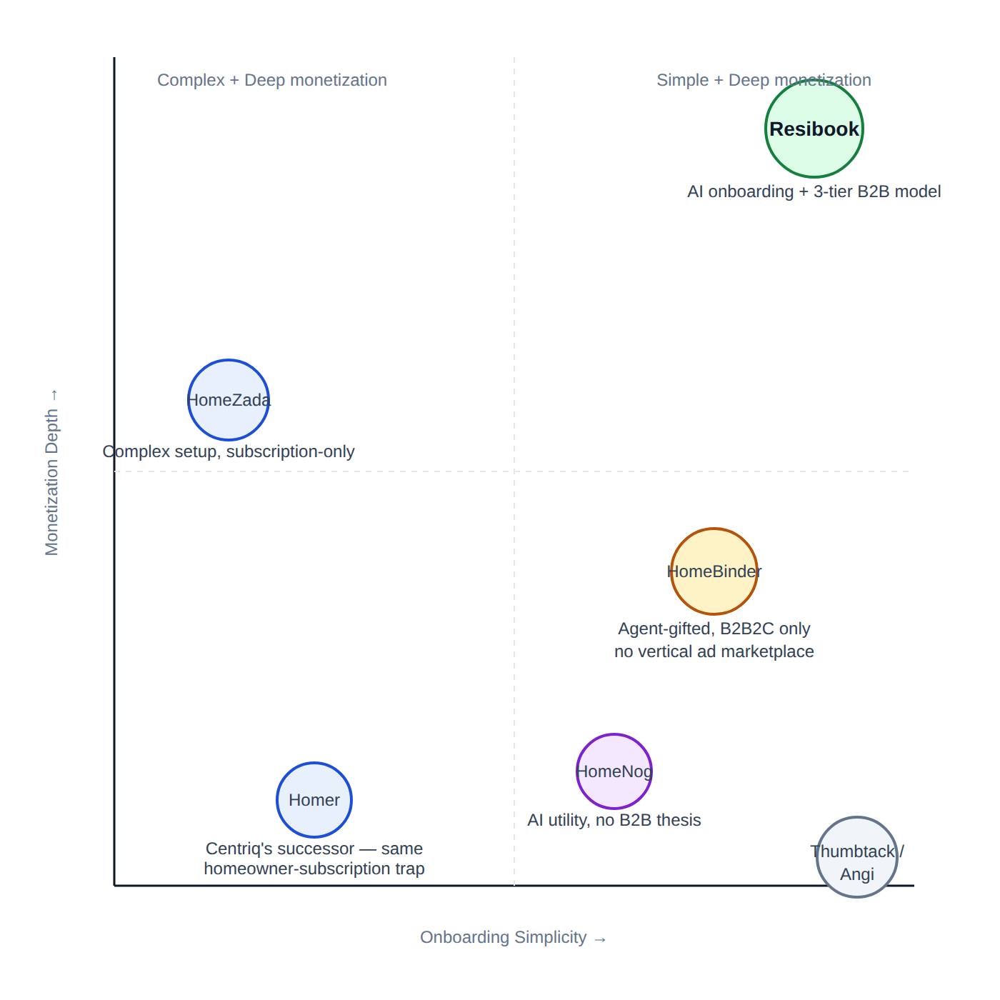
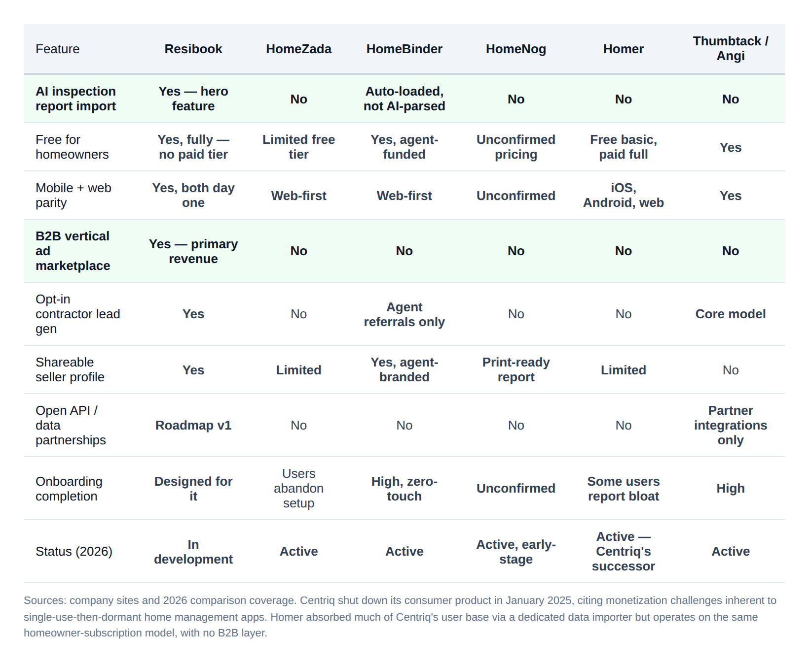
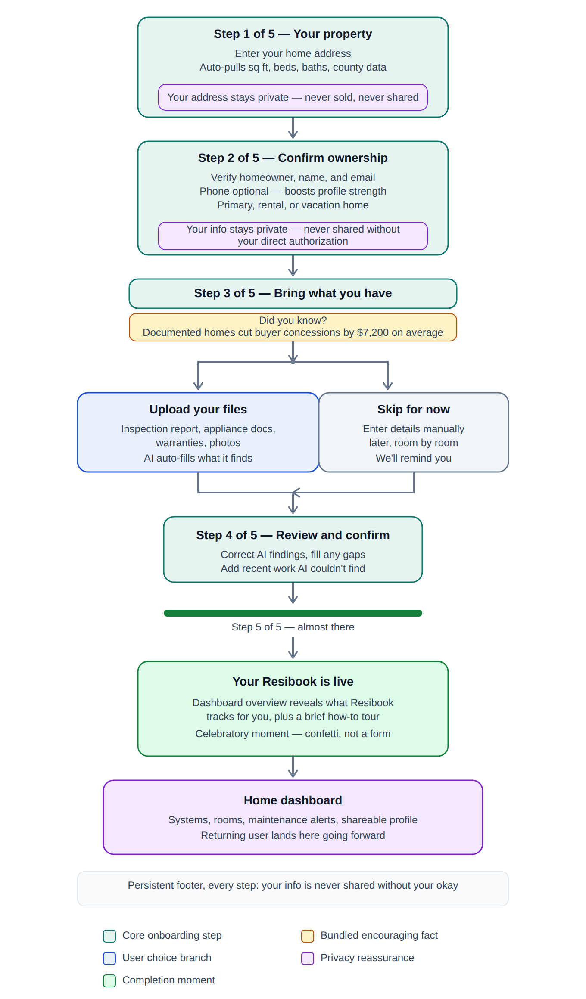

# Resibook — Product Requirements Document

**Author:** Kevin Lisk, Senior Product Manager  
**Status:** Draft v1.0  
**Last Updated:** June 2026  
**Document Type:** Modern PRD (Portfolio)

---

## TL;DR

Every year, roughly 4 million existing homes change hands in the U.S. — and with each sale, the home's history disappears with it. Buyers inherit unknowns. Sellers can't prove value. Contractors show up blind. Resibook is a mobile and web platform that creates a living digital record of a home — starting at the moment of purchase with an inspection report import — and turns that record into a negotiation asset at resale, a maintenance intelligence layer during ownership, and a verified intent signal for home services advertisers. Free for homeowners. Monetized through a B2B vertical ad marketplace and data partnerships at the point of transaction.

---

## Problem

### What's Broken

When a home sells, its history doesn't transfer. The buyer gets a snapshot — an inspection report, a disclosure form, maybe a stack of warranties in a kitchen drawer — but no longitudinal record of what was done, when, by whom, or with what materials. The result is a compounding information gap that costs everyone:

- **Buyers** pay concessions averaging $7,200 at closing to account for uncertainty they can't quantify
- **Sellers** leave money on the table because they can't prove the value of maintenance they actually did
- **Contractors** quote blind, without knowing what's already in the home
- **Brands** (paint, HVAC, appliances) have no verified visibility into which homes contain their products

In today's DIY-driven home improvement culture — where a YouTube tutorial can teach a homeowner to install laminate flooring or rewire a light fixture — the gap between what's been done to a home and what's documented about it is wider than ever.

### Why Now

Three forces have converged:

1. **Inspection reports are now digital and structured** — AI can parse them
2. **Home improvement spending hit $603B in 2024** — documentation demand follows investment
3. **The closest competitors validate demand but leave a clear opening** — HomeZada has the most product overlap but overwhelms users and lacks a B2B model; HomeBinder nails distribution and onboarding but caps its own revenue ceiling by monetizing only through agent goodwill

### The Maintenance Cost Gap

Beyond the transaction moment, there is a quieter, recurring cost: poor maintenance tracking pushes homeowners from manageable annual upkeep into expensive reactive repairs. Annual appliance maintenance plans run $200–500 per year and extend appliances toward their full 13–15 year design lifespan. By contrast, a single reactive repair call averages $171, with major component failures (compressors, control boards, motors) routinely running $400–800 — and that is before factoring in the inconvenience of an unplanned breakdown. Homeowners without a maintenance record do not know what needs servicing or when, so small, cheap problems become large, expensive ones. Resibook's maintenance dashboard converts this from a reactive cost center into a planned annual budget line — the same shift a fleet manager makes when moving from breakdown maintenance to scheduled service.

---

## Users

### Primary: The New Homebuyer (Maya, 31)

Maya just closed on her first home. She has an inspection report, a list of things to fix, and zero context on what's already been done. She's motivated, overwhelmed, and on her phone. She needs Resibook to meet her where she is — upload your inspection report and we'll do the rest. She's the highest-intent user in the product lifecycle because she has the most to gain from starting a record from day one.

**Key behaviors:** Mobile-first, high motivation at close, open to product recommendations, likely to share Resibook with her real estate agent

### Secondary: The Seller (Marcus, 52)

Marcus has lived in his home for 11 years. He's repainted, replaced the HVAC, renovated the kitchen, and done it mostly right. But when the buyer's agent asks for receipts, he's digging through email and cardboard boxes. Resibook gives him a retroactive onboarding path — log what you remember, upload what you have — and a shareable Resibook profile that becomes a negotiation asset. The $7,200 average buyer concession is his enemy. A documented home is his defense.

**Key behaviors:** Desktop-first, goal-oriented (reduce concessions, increase sale price), willing to pay for features tied to a concrete financial outcome

### Tertiary: The Active Homeowner (Priya, 44)

Priya isn't selling anytime soon, but she's mid-renovation and wants to log materials before she forgets. She's not the acquisition target — she's the retention story. Triggered into Resibook by a specific event (renovation, appliance purchase, insurance renewal), not by broad awareness. She keeps the record alive between transactions.

**Key behaviors:** Sporadic usage, high value per update, responds to maintenance reminders and AI-driven alerts

---

## Solution

### What Resibook Does (v1)

Resibook creates a verified, living digital record of a home — organized by system, room, and timeline — starting from the moment of purchase.

#### Hero Feature: Inspection Report Import + Smart Onboarding

The v1 entry point. A new homeowner uploads their inspection report (PDF). Resibook's AI parses the document and auto-populates:

- Property attributes (sq footage, bedroom/bathroom count, year built)
- Major systems identified (HVAC, water heater, roof, electrical panel)
- Flagged items and recommended actions
- Estimated ages of systems where noted

The user then walks through a structured onboarding — confirming, correcting, and adding to what the AI found. The result is a Resibook that is 60–80% complete before the user has manually entered a single thing. This directly solves the abandonment problem that kills HomeZada.

#### Core Product Surfaces (v1)

**Home Dashboard**
- System health overview (HVAC, water heater, roof, appliances)
- Estimated age + remaining life per system
- Maintenance alerts and upcoming tasks
- Maintenance predictions based on system age, typical lifespan, and location
- Annual maintenance budget planning, framed against the cost of reactive repair

**Room-by-Room Log**
- Paint: brand, color name, finish, room
- Flooring: material, manufacturer, install date
- Tile, hardware, fixtures: photo + metadata
- Warranty documents: attached per item

**Resibook Profile (Shareable)**
- A clean, read-only view of the home's documented history
- Shareable via link for real estate transactions
- Includes a Resibook Completeness Score (not a home value score — a documentation confidence score)

**Onboarding Flow**
1. Enter address → auto-pull property attributes from public records
2. Upload inspection report → AI parses and populates systems
3. Confirm / correct AI findings
4. Add any additional context (recent work, materials, appliances)
5. Resibook is live

---

## Out of Scope (v1)

The following are explicitly deferred to keep v1 focused and shippable:

- **Contractor marketplace** — finding and booking contractors is a v2 feature; v1 logs the work after the fact
- **Financial tracking / home equity dashboard** — HomeZada does this and it creates complexity; Resibook is a home history product, not a financial product
- **HOA management** — separate use case, separate user
- **Multi-property management** — v1 supports one home per account; investors are not the target user. *V2 fast follow: open the platform to property management groups managing multiple units — a natural expansion that shares the same data model without diluting the homeowner-first v1 experience.*
- **Insurance integrations** — high-value but requires enterprise partnerships; roadmap item
- **DIY instructional content** — out of brand scope; Resibook documents, it doesn't teach

---

## Competitive Landscape





| | Resibook | HomeZada | HomeBinder | HomeNog | Homer | Thumbtack / Angi |
|---|---|---|---|---|---|---|
| AI inspection report import | ✅ Hero feature | ❌ | ⚠️ Auto-loaded, not AI-parsed | ❌ | ❌ | ❌ |
| Free for homeowners | ✅ | ⚠️ Limited free tier | ✅ Agent-funded | ⚠️ Unconfirmed pricing | ⚠️ Free basic, paid full | ✅ |
| Mobile + web parity | ✅ Both day one | ⚠️ Web-first | ⚠️ Web-first | ⚠️ Unconfirmed | ✅ iOS, Android, web | ✅ |
| B2B vertical ad marketplace | ✅ Primary revenue | ❌ | ❌ | ❌ | ❌ | ❌ |
| Opt-in contractor lead gen | ✅ | ❌ | ⚠️ Agent referrals only | ❌ | ❌ | ✅ Core model |
| Shareable seller profile | ✅ | ⚠️ Limited | ✅ Agent-branded | ✅ Print-ready report | ⚠️ Limited | ❌ |
| Open API / data partnerships | ✅ Roadmap v1 | ❌ No API | ❌ | ❌ | ❌ | ⚠️ Partner integrations only |
| Onboarding completion | ✅ Designed for it | ❌ Avg user abandons setup | ✅ Zero-touch via agent gift | ⚠️ Unconfirmed | ⚠️ Some users report bloat | ✅ |
| Status (2026) | In development | Active | Active | Active, early-stage | Active, Centriq's successor | Active |

### Key Differentiation

Three competitors matter most, for different reasons.

**HomeZada** is the closest analog in product surface area — home inventory, maintenance, and documentation — but has created the clearest opening on usability: it is the validated market leader with a product that overwhelms its users, charges $65–100/year, has no API, and has never built a supply-side revenue model.

**HomeBinder is the sharper competitive threat.** Its distribution model is genuinely excellent — real estate agents and home inspectors gift it to clients at closing, pre-loaded with the inspection report, producing high-completion onboarding without asking homeowners to do anything. HomeBinder also maintains a strict no-data-resale policy, which sets a credible privacy bar Resibook must match or exceed. But HomeBinder's monetization is structurally shallow: it is funded entirely by real estate professionals paying for client retention tools, and the platform has pivoted further away from documentation toward a "moving concierge" service. It has never built a vertical advertiser marketplace, and its agent-funded model caps its revenue ceiling at what real estate professionals are willing to pay for client goodwill — nowhere near the CPM economics available from paint, HVAC, and appliance brands buying verified intent data.

**HomeNog is the closest feature-level peer**, and worth watching as an early-stage product. It offers AI-powered appliance recognition from photos, natural-language queries against a home's inventory, and a print-ready report explicitly designed to hand to a buyer or realtor at sale — conceptually adjacent to Resibook's shareable profile. It also markets itself as privacy-first. However, HomeNog has no inspection report import (Resibook's hero onboarding feature), no stated monetization model beyond the product itself, and no B2B marketplace ambition — it reads as a well-built utility, not a platform with a revenue thesis.

**Thumbtack and Angi** validate the lead-generation layer of Resibook's model (Tier 2) but have no home documentation product at all — they monetize the moment of need, not the ongoing record that creates that need's context.

**Centriq is a cautionary tale, not a competitor.** The company shut down its consumer product in January 2025 after struggling to monetize a single-use-then-dormant usage pattern: homeowners set up the app once and returned only when something broke, which undermines subscription revenue. Homer has since emerged as Centriq's de facto successor, building a dedicated Centriq data importer to absorb its user base, and operates on the same fundamental model Centriq did — a homeowner-funded subscription with no B2B layer. This is precisely the trap Resibook's B2B-first monetization model is structurally designed to avoid — revenue does not depend on homeowner re-engagement or willingness to pay a subscription; it depends on the durability and growth of the underlying data asset, which appreciates the longer a home stays documented, regardless of how often the homeowner opens the app.

Resibook's structural advantage is not feature parity with any single competitor — it is a business model that does not yet exist in this category: a free, simple-to-onboard product (matching HomeBinder's distribution strength, HomeNog's AI utility) layered with the only vertical B2B ad marketplace in the space (a gap nobody in this set has filled).

---

## Privacy & Data Architecture

Resibook's entire monetization thesis depends on a strict separation between personal identity and property data — and that separation is a product commitment, not a settings toggle.

**Personally identifiable information (name, email, phone, street address) is never sold, shared, or exposed to advertisers, under any circumstance, without the homeowner's explicit, separate opt-in.** This data exists to operate the account and to power the shareable Resibook profile a user chooses to send to a buyer's agent or contractor — nothing more.

**Anonymized property attributes are pooled to build advertiser audiences.** A paint brand can reach "homes with Sherwin-Williams exterior paint applied 4+ years ago in ZIP code 95610." It cannot reach "Kevin Lisk at [address]." The targeting layer operates on aggregated, de-identified property characteristics — never on the individual record. This is the same architectural principle that makes programmatic advertising privacy-compliant at scale: audience-level targeting, not individual identification.

**The one exception is explicit and user-initiated: "Get help from a professional."** When a homeowner actively requests contact from a contractor, advertiser, or service provider — through a native lead-gen feature or a sponsored placement they choose to act on — their contact information is shared with that specific party, and only because the user took an affirmative action to request it. This is opt-in lead generation, not passive data sharing, and it is the one place PII crosses from Resibook to a third party. The distinction matters: Resibook is not telling a paint brand who lives at an address; Resibook is letting a homeowner say "yes, have Benjamin Moore's local rep call me about my exterior."

This distinction is communicated to users at two points in the product: a dedicated explainer during onboarding (before any sensitive documents are uploaded) and a persistent, low-key reassurance note visible throughout the onboarding flow. Trust here is not a compliance checkbox — it is the foundation the entire B2B revenue model rests on. A single visible breach of this boundary would collapse both user trust and the data asset's value to advertisers, who also do not want to be associated with privacy-invasive targeting.

---

## Monetization Model

Resibook is free for homeowners — entirely, with no paid tier. Every feature described above is available to every homeowner at no cost. Revenue comes exclusively from the supply side.

This is a deliberate choice, not a default. Charging homeowners for features like maintenance scheduling or document storage would mean competing on the same broken model as HomeZada, Homer, and Centriq before its shutdown — a model where revenue depends on convincing individual homeowners to pay for utility software, and where the product's incentive is to maximize subscription conversions rather than maximize the size and quality of the underlying home record. Resibook's incentives point the opposite direction: the more homes are fully documented, free of any paywall friction, the more valuable the aggregate data asset becomes to B2B advertisers. A free, frictionless homeowner experience isn't a cost center to offset — it's the input that makes the B2B side work.

### Tier 1: B2B Vertical Ad Marketplace (Primary Revenue)

Resibook's data asset — verified, room-level home attribute data — is uniquely valuable to a category of advertisers that has never had purchase-intent signals this specific:

| Advertiser Category | What They Know From Resibook | What They Pay For |
|---|---|---|
| Paint brands (Benjamin Moore, Sherwin-Williams) | Which rooms were painted, with what brand, when | Targeted repainting reminders + competitive conquest |
| HVAC manufacturers / service providers | System age, last service date, location | Maintenance outreach at predicted replacement window |
| Appliance brands (GE, Samsung, LG) | Appliance age, model, warranty status | Replacement offers timed to end-of-life |
| Flooring / tile manufacturers | Materials used, install date, room | Remodel and replacement targeting |
| General contractors / home services | Full home profile at point of project consideration | Qualified lead at highest intent moment |

This is not banner advertising. It is **intent-matched, home-verified, lifecycle-timed outreach** — a category that does not exist anywhere in digital advertising today. The closest analog is automotive data (knowing a car's age, mileage, and service history to time replacement offers), which commands significant CPM premiums over standard display.

**CPM Benchmark Context (2026):**
Standard programmatic display runs $1–$4 CPM on open exchange. Behavioral or interest-targeted display commands $4–$10 CPM. B2B firmographic or high-specificity targeting reaches $10–$25 CPM. Private marketplace (PMP) deals — where inventory quality and audience precision are verified — average $8–$20 CPM with 20–35% higher viewability than open exchange. Resibook's home-verified intent data operates in PMP territory by design: advertisers are not buying broad audiences, they are buying verified records of homes with known attributes at the exact lifecycle moment that triggers purchase consideration. A conservative Resibook CPM target of $12–$18 is well-supported by these benchmarks and positions the product within the range that automotive and home services brands already pay for comparable purchase-intent precision.

### Tier 2: Opt-In Professional Referrals (Lead Generation)

Distinct from the anonymized ad marketplace, Resibook supports a "Get help from a professional" feature where a homeowner actively requests contact from a contractor, brand representative, or service provider. This is the one mechanism where PII is shared with a third party — and only because the homeowner initiated it. A user who sees a maintenance alert for an aging water heater can tap to request a quote, at which point their contact information is passed to a matched professional. Resibook charges the professional a qualified-lead fee, similar to the Thumbtack/Angi model — but with dramatically higher lead quality, since the request is grounded in verified home data rather than a generic service search. This tier monetizes intent at the moment it is highest, while keeping the B2B ad marketplace (Tier 1) entirely anonymized.

### Tier 3: Transaction Data Partnerships (Year 2+)

At the moment a home is listed for sale, the Resibook profile becomes a verified disclosure supplement. Partners include:

- Title companies (verified home history reduces liability)
- Home warranty providers (underwriting informed by actual system ages)
- Real estate platforms (Zillow, Realtor.com) — Resibook data as a listing enhancement
- Mortgage lenders (home condition as a risk signal)

---

## Success Metrics

### North Star Metric

**Resibooks Completed Per Month** — a Resibook is "complete" when it has a verified address, at least one major system logged, and a room-level record for at least one room. This is the metric that predicts both retention and monetization: a complete Resibook is a user who has invested in the product and created data that has advertiser value.

### Supporting Metrics

| Metric | What It Measures | Target (Month 6) |
|---|---|---|
| Inspection Report Import Rate | % of new signups who complete import onboarding | >60% |
| Onboarding Completion Rate | % of users who reach a "complete" Resibook | >40% |
| D30 Retention | Are users coming back after the first month? | >25% |
| Shareable Profile Activation Rate | % of users who generate a shareable Resibook link | >15% |
| B2B Advertiser CPM | Revenue per 1,000 matched home records | $12–18 (benchmark: PMP deals avg $8–20; behavioral targeting $4–10; B2B firmographic targeting $10–25) |

### Anti-Metrics (What We're Not Optimizing For)

- **DAU** — Resibook is not a daily-use product; optimizing for daily engagement would drive the wrong features
- **Total registered users** — vanity metric; a Resibook with no data has no advertiser value and no retention value
- **Pages per session** — depth of documentation matters more than breadth of browsing

---

## Open Questions

These are honest unknowns that require research, testing, or partnership conversations before v2 planning:

1. **Inspection report parsing accuracy** — How structured are inspection report PDFs across different inspection software tools? What's the error rate on AI extraction, and how does the confirmation UX handle corrections without creating friction?

2. **Advertiser CPM validation** — The B2B ad marketplace thesis depends on advertisers valuing home-verified data at a premium. This needs validation through 3–5 discovery conversations with brand advertisers before building the supply-side product.

3. **Privacy and data consent model execution** — The architecture is defined: PII is never shared with advertisers, only anonymized property-level data is pooled for targeting. The open question is execution, not principle — what specific aggregation thresholds (minimum audience size per segment) prevent re-identification in low-density ZIP codes, and what third-party privacy certification (if any) should Resibook pursue to make this credible to advertisers and homeowners alike?

4. **Seller upgrade conversion rate** — Will sellers pay $4.99/month when a transaction is imminent? Or does the free tier need to be more constrained to create upgrade pressure without damaging trust?

5. **Real estate agent as a distribution channel** — Agents have a natural incentive to give Resibook to buyers at closing. Is there a referral or co-branding model that makes agents active distributors without making Resibook feel like a brokerage product?

---

## Appendix

### A: Onboarding Flow (v1)



```
[Landing / Download]
        │
        ▼
[Enter Your Address]
   Auto-pull: sq ft, bed/bath, county, public permits
   + Privacy reassurance: "Your address stays private — never sold, never shared"
        │
        ▼
[Confirm Ownership + Contact Info]
   Name, email, optional phone
   + Fact: "Planned upkeep runs $200–500/yr vs $171+ per surprise repair"
        │
        ▼
[Bring What You Have]
   + Fact: "Documented homes cut buyer concessions by $7,200 on average"
        │
        ├──► [Upload Inspection Report + Files]  ──┐
        │     AI parses: systems, ages, flagged     │
        │     items, recommendations                │
        │                                            │
        └──► [Skip — Enter Manually Later]  ─────────┤
              (Room-by-room entry, reminder set)      │
                                                       ▼
                                          [Review + Confirm AI Findings]
                                             User corrects errors, fills gaps
                                                       │
                                                       ▼
                                          [Your Resibook Is Live]
                                             Dashboard → Systems → Rooms → Share

Persistent footer note, every step: "Your personal info stays private — always"
```

### B: User Journey Map — New Homebuyer (Maya)

| Stage | Moment | Resibook Role | Emotion |
|---|---|---|---|
| Pre-close | Home inspection completed | — | Anxious, overwhelmed |
| Close | Keys in hand | Onboarding trigger | Excited, motivated |
| Day 1–7 | Moving in | Import inspection report, confirm systems | Productive, building confidence |
| Month 1–3 | First maintenance task | Dashboard alert, log the work | Capable, organized |
| Month 6–12 | First repair / upgrade | Log materials, upload receipt | Invested |
| Year 3–5 | Thinking about selling | Activate shareable profile | Strategic |
| Sale | Listing goes live | Resibook shared with buyer's agent | Confident, protected |

### C: Competitive Positioning Statement

*For new homeowners who inherit a home full of unknowns, Resibook is the living digital record that turns a house into a documented asset — starting with your inspection report. Unlike HomeZada, which overwhelms homeowners with complexity and a $65–100/year paywall, Resibook is free to use, simple to start, and gets smarter the longer you own your home.*

---

*This document was developed as part of a Senior PM portfolio project demonstrating marketplace monetization strategy, consumer product positioning, and B2B revenue model design. Domain expertise: PropTech, marketplace advertising, conversion funnel optimization.*
